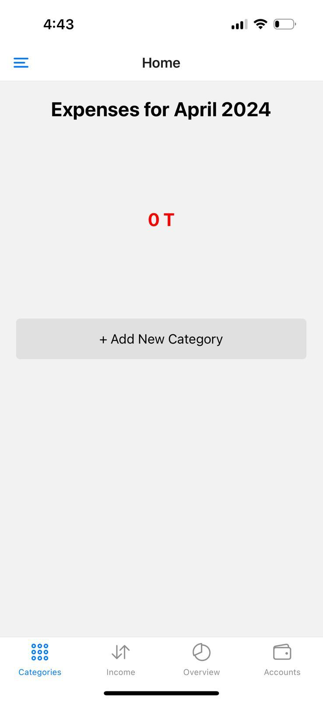
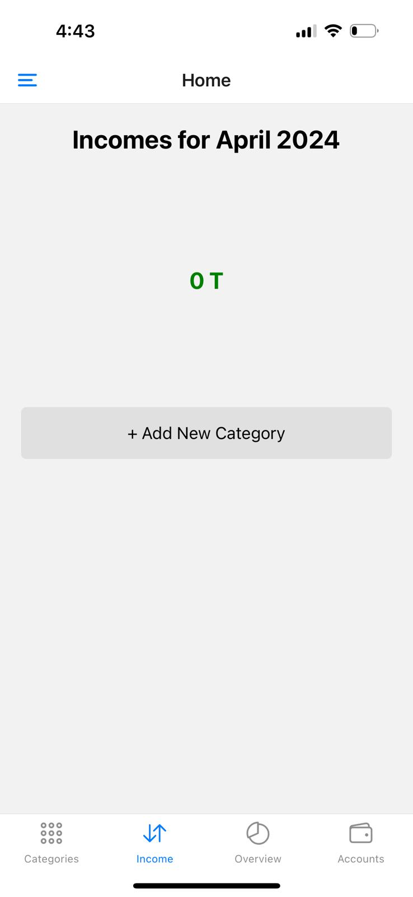
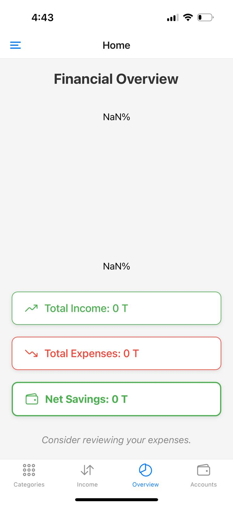
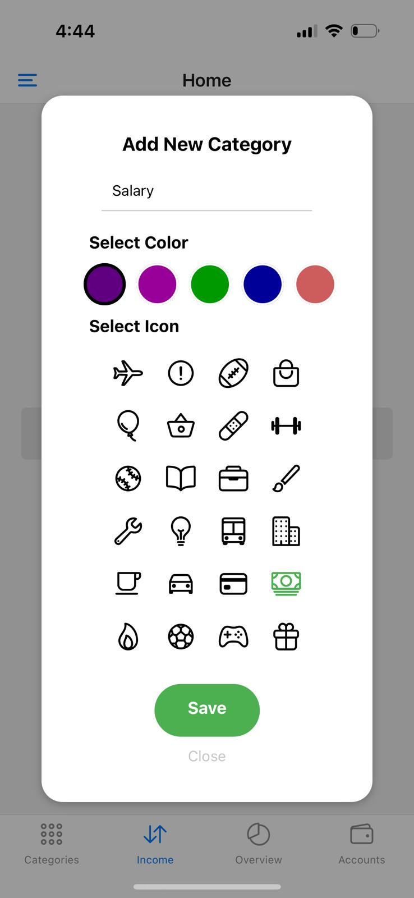
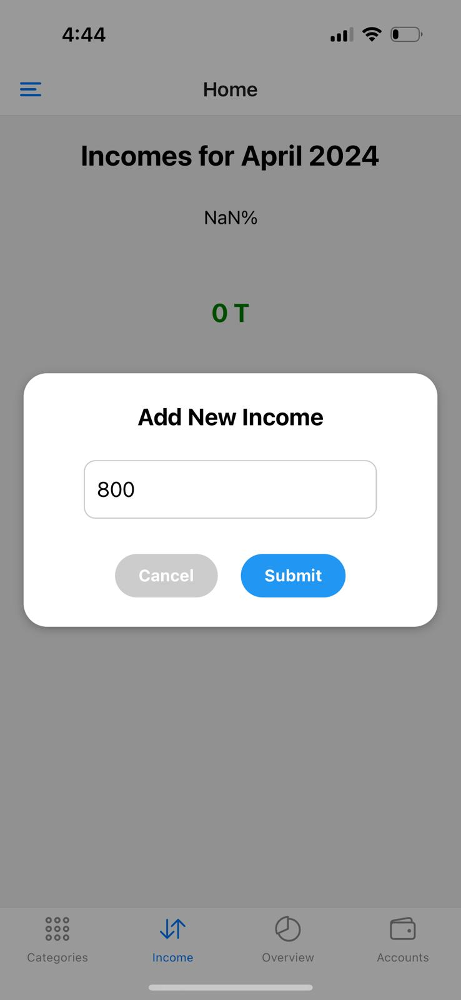
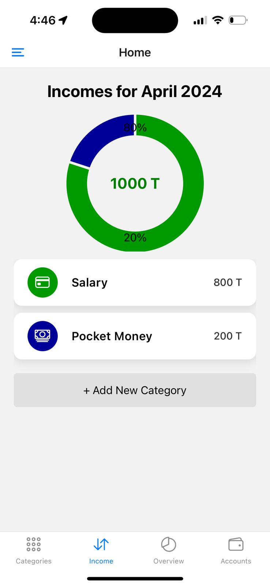
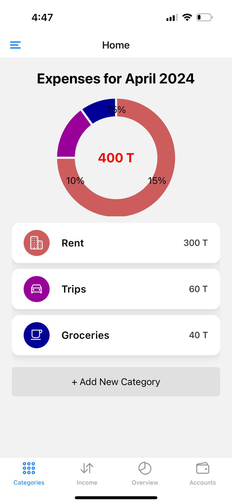
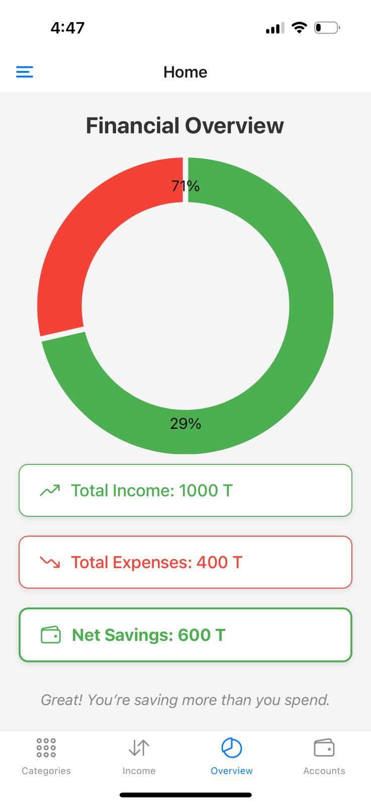

# Expense Tracker
ExpenseTracker is a sleek and user-friendly mobile application designed to help you keep track of your expenses with ease and precision.
With ExpenseTracker, you can conveniently log your expenses anytime, anywhere, whether it's a cup of coffee, grocery shopping, or rent. Simply input the amount, select the category and click done. Your expense is recorded in seconds. 

## Features
1. Allows the Users to manage their Incomes.
2. Enables the users to keep track of their expenses by displaying a visual representation of their expenses.
3. Finally Helps the users by calculating their Income, Expenses and displays their Savings.

## Video Link

## App Description

The application is divided into 3 parts
1. Categories - This is where the expenses of the user are added.

 

2. Income - This is where the different sources of income of the user are added.

 

3. Overview - This page displayes the total Income, Total Expenses and the Total Savings of the user.

 
   
The users can add their sources of income as shown in the below screenshots.

First The user enters the type of income. In this case it is Salary.

Then the user enters his salary (800)

Users enters all their Incomes 

In the same way user enters his expenses in the categories section.

Now when the users navigates to the Overview section it calculates his savings for them.

